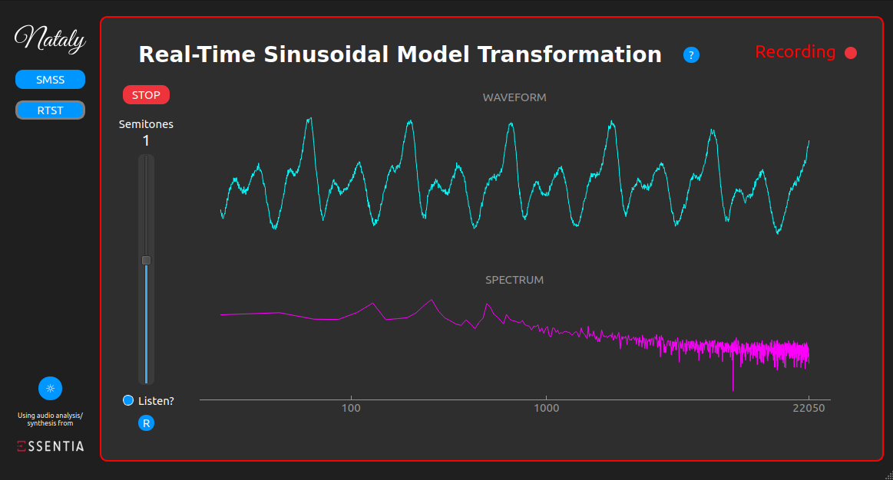
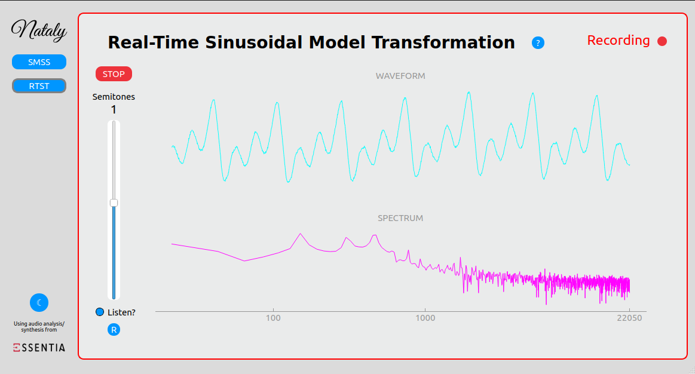

# Nataly
This is a GitHub repository made to store the development of a the Nataly Sound Analysis/Synthesis App which allows users to make real-time voice transformations and spectrogram analysis using the Sinusoidal Model.

# Execution instructions and libraries installation

The project is executed using the main.py file which takes into account all the different interfaces(main, sinusoidal_spec_anal and rt_sine_transformation).
In order to execute the project is recommended to use a Python v3.10 interpreter with the following libraries properly installed:

- numpy v1.21.5
- essentia.standard v2.1b6.dev858
- PyAudio v0.2.13
- sounddevice v.0.4.5
- PyQt5 v5.15.7
- pyqtgraph v0.13.1

## Libraries installation

To install all those dependencies you can follow the following sintaxis on your Ubuntu terminal (you must have pip correctly installed on your computer):

Install numpy:

`pip install numpy==1.21.5`

Install Essentia:

`pip install essentia==2.1b6.dev858`

Install PyAudio:

`pip install PyAudio==0.2.13`

In case of trouble with the PyAudio installation, use the following command to install the dependencies:

`sudo apt-get install libasound-dev portaudio19-dev libportaudio2 libportaudiocpp0`

Install SoundDevice:

`pip install sounddevice==0.4.5`

Install PyQt5:

`pip install PyQt5==5.15.7`

Install pyqtgraph:

`pip install pyqtgraph==0.13.1`

## Execution of the project

Then, go to the project folder:

`cd Nataly-main`

And execute the python code inside the main.py file:

`python3 main.py`

# Documentation images

| Dark Themed Spectrogram Sound Synthesizer

| Light Themed Spectrogram Sound Synthesizer

| Dark Theme Real-Time Sinusoidal Transformation

| Light Themed Real-Time Sinusoidal Transformation

| Sinusoidal Spectrogram Synthesizer Helping Window

| Real-Time Sinusoidal Transformation Helping Window

| Spectrogram explanation

| Spectrum explanation

